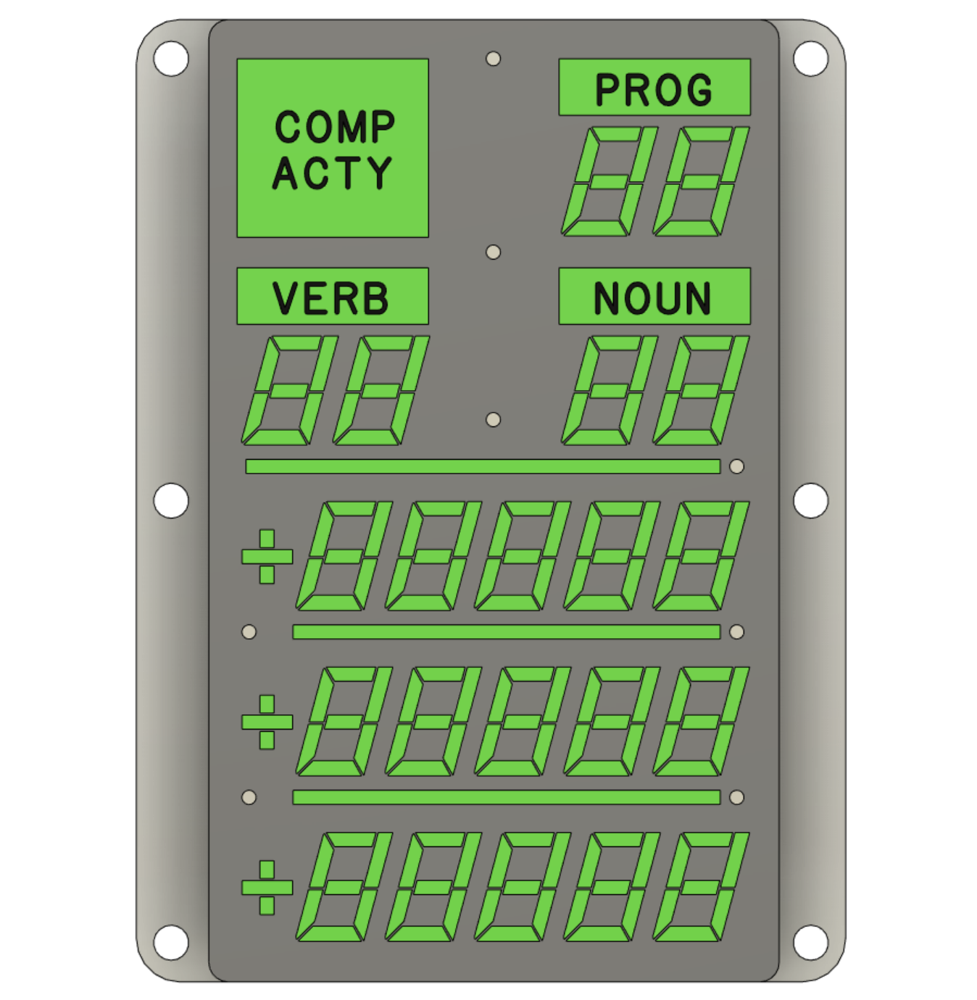

# DSKY Alarm Indicator Panel Replica

## *This project is a work in progress -- reuse at your own risk*

This is a scale functional replica of the Digital Indicator panel for the Apollo Guidance Computer. It is
designed to be part of a larger replica of the Display and Keyboard (DSKY) module of the AGC.

This project is composed of these component subfolders:

* **artwork** - artwork to be printed or silk-screened onto the glass/acrylic cover.

* **pcb** - KiCad project for the controller PCB design

* **firmware** - Arduino-based controller firmware.  This module is designed to be controlled via the USB serial interface.

* **hardware** - 3D-printable frame components designed using Fusion 360. STEP and Fusion source files available. Hardware models used in thie replica were derived from models found in the [AGC Mechanical CAD project](https://github.com/rrainey/agc-mechanical-cad).

## Printed Circuit Board Status and Assembly

Summary below. You will find more detailed notes in the [./pcb folder](./pcb/PCB-NOTES.md).

As of late February, 2021, I am preparing to test version V3 of the PCB. I hope this will be the version suitable for general use. 
I ordered parts from Digi-Key; you will find Digi-Key part numbers as part of the KiCad
component list in the schematic.

I use a solder reflow oven in my shop. I plan to use a [two step process](https://www.instructables.com/Making-double-side-boards-in-reflow-oven/) to first reflow the back (LED) side using Sn63/Pb37 paste, then reflow the front side using a lower temperature solder paste (Bi57Sn42Ag1).  

## Painting

The original NASA drawings for all variants of this component, [1006387D for example,](https://archive.org/stream/apertureCardBox439Part2NARASW_images#page/n409/mode/1up) point to [this NASA paint specification [1008809-1]](https://archive.org/stream/apertureCardBox443NARASW_images#page/n504/mode/1up). It states [FED-STD 36231](http://federalstandard595.com/36231/) as the external color of the unit.  Good quality historial photos (examples [here](https://www.icollector.com/Apollo-CM-DSKY_i21861898) and [here](http://nassp.sourceforge.net/wiki/File:DSKY.jpg)) seem to imply a slightly different shade of gray, though. 

I may custom mix using Nazdar pigments, or I might simply use [an aircraft-grade epoxy premix](https://www.skygeek.com/deft-01-series-epoxy-topcoat-gray-36231-mil-prf-227750g.html) of FS36231. For now, I am simply using Krylon brand [Ultra Matte Finish - 4102 Misty Gray](https://www.google.com/search?q=Ultra+Matte+Finish+-+4102+Misty+Gray&rlz=1C1AFAB_enUS475US475&oq=Ultra+Matte+Finish+-+4102+Misty+Gray&aqs=chrome..69i57.432j0j7&sourceid=chrome&ie=UTF-8) paint.

## Credits and Related Projects

This project is inspired by work by Ben Krasnow creating a DSKY Electroluminescent Panel replica. You'll
find information about that project in [this Applied Science video](https://www.youtube.com/watch?v=Z2o_Sp2-aBo) by Ben. Like Ben's E/L display, this project is driven by an AT SAMD21 microcontroller chip; the same chip is used in the multiple Adafruit microcontroller boards, including the Adafruit Trinket M0.

## DSKY Digital Indicator License

Creative Commons Attribution/Share-Alike, all text above must be included in any redistribution. See license.txt for additional details.

## My Background

My name is Riley Rainey. I'm a software developer by profession. I spent a number of years building aerospace simulations as my day job.

## Getting Support

There's no official support available, but you can [leave comments or create an issue](https://github.com/rrainey/DSKY-digital-indicator-replica/issues) in this GitHub project.

  
This work is licensed under a [Creative Commons Attribution-ShareAlike 4.0 International License](http://creativecommons.org/licenses/by-sa/4.0/).
